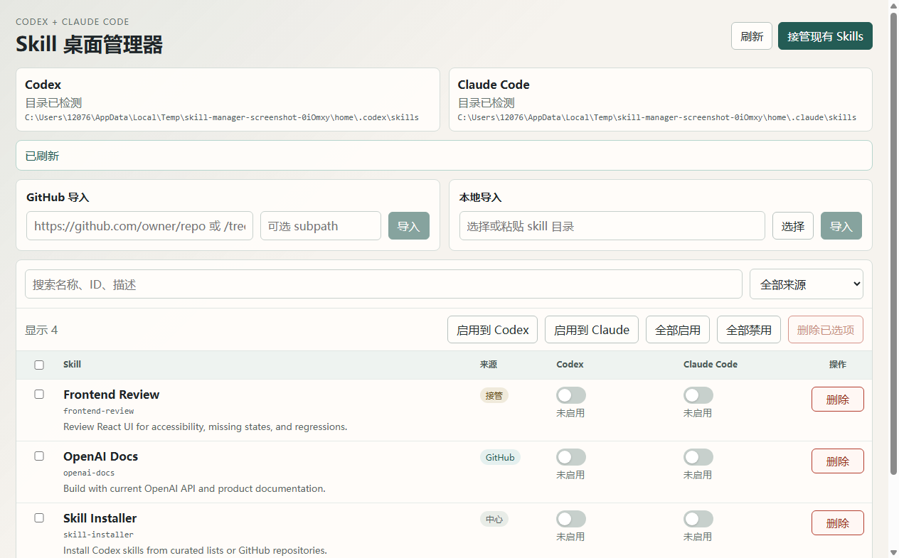

# Skill Desktop Manager

一个用于集中管理 Codex 与 Claude Code skills 的桌面应用。普通用户可以直接下载安装包使用，开发者也可以从源码运行。



## 下载

前往 [Releases](https://github.com/Vink567/Skill-Desktop-Manager/releases/latest) 下载最新版。

Windows 用户：

- 下载 `Skill.Desktop.Manager.Setup.0.1.0.exe`
- 双击运行安装包
- 安装完成后从桌面快捷方式或开始菜单启动

macOS 用户：

- Apple Silicon 芯片（M1/M2/M3/M4）下载文件名包含 `arm64` 的 `.dmg`
- Intel 芯片下载文件名包含 `x64` 的 `.dmg`
- 打开 `.dmg` 后，把 `Skill Desktop Manager` 拖到 `Applications`
- 首次启动如果提示来自未知开发者，可以在 Finder 中按住 Control 点击应用，选择“打开”

当前安装包暂未做 Windows 代码签名或 Apple notarization。确认来源为本仓库 Release 后再继续安装或打开。

## 使用步骤

1. 启动应用后，点击右上角的“接管现有 Skills”，应用会扫描当前电脑上的 Codex 和 Claude Code skills 目录。
2. 如果要从 GitHub 安装 skill，把仓库地址粘贴到“GitHub 导入”，需要指定子目录时填写 `subpath`，然后点击“导入”。
3. 如果要从本地文件夹安装 skill，在“本地导入”选择或粘贴 skill 目录，然后点击“导入”。
4. 在列表中选择一个或多个 skills，点击“启用到 Codex”“启用到 Claude”或“全部启用”。
5. 点击 skill 名称可以查看详情和 `SKILL.md` 内容。
6. 不再需要的 skill 可以勾选后点击“删除已选项”，应用会清理自己创建的链接或副本。

## 主要功能

- 统一查看 Codex 和 Claude Code 的 skill 状态。
- 从 GitHub URL 或本地目录导入 skills。
- 对单个或批量 skills 启用、禁用 Codex 和 Claude Code 集成。
- 查看 skill 元数据和 `SKILL.md` 内容。
- 手动设置工具的 skills 目录，适配不同本地环境。
- 删除已安装 skills，并清理本应用创建的链接或副本。

## 从源码运行

```bash
npm install
npm run dev
```

## 开发命令

```bash
npm test           # 运行 Vitest 测试
npm run build      # 类型检查并构建 Electron 应用
npm run smoke      # 构建后运行 Electron 冒烟测试
npm run screenshot # 重新生成 README 截图
npm run dist       # 生成 Windows 安装包
npm run dist:mac   # 在 macOS 上生成 dmg/zip
```

## 发布说明

Windows 安装包可以在 Windows 本机生成；macOS 安装包必须在 macOS 上生成。本仓库提供 GitHub Actions 工作流，会在 Windows 和 macOS runner 上分别运行测试、源码冒烟测试、构建安装包，并启动打包后的应用本体验证核心功能，再把产物上传到指定 Release。

## 项目结构

- `electron/main`：主进程、配置、扫描、安装、删除和工具链接逻辑。
- `electron/preload`：向 renderer 暴露受控 IPC API。
- `src/renderer`：React 桌面界面。
- `tests`：服务逻辑和 UI 结构测试。
- `scripts`：冒烟测试与截图生成脚本。

## 说明

仓库只保存源码、测试、配置和锁文件。`node_modules`、`out`、`release*`、日志和临时构建产物已通过 `.gitignore` 排除。安装包会作为 GitHub Release 附件发布，方便用户直接下载。
